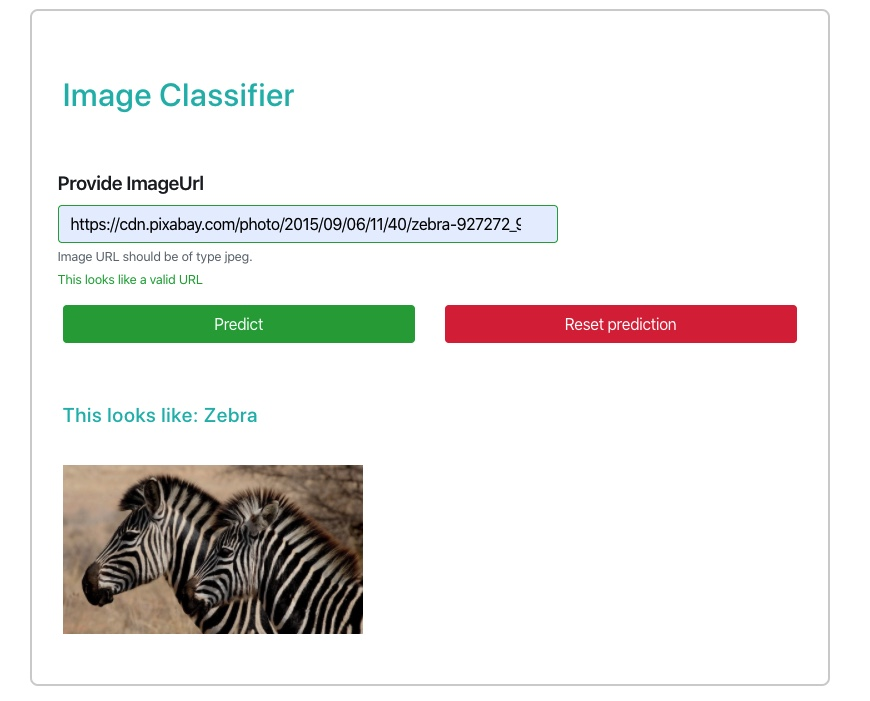

# Cloud Native Orchestration

*Capstone project for Udacity's Cloud DevOps Nanodegree*

We will prepare an image recognition service. This service constitues a react frontend, a golang gRPC API serving and a [Tensorflow ModelServer](https://www.tensorflow.org/tfx/guide/serving). (TensorFlow Serving is a flexible, high-performance serving system for machine learning models, designed for production environments.)

---

## Application Architecture

A user submits an image url to the frontend service. The service makes a POST request and displays the result. The result is acquired when, the api sends a proto request and receives a proto response. 

A result looks like this:




## Pipeline


## Deployment Strategy

We will be using a rolling update strategy for all microservices to ensure that we always have available instances. The following snippet show's how this is done in kubernetes:
```
spec:
  replicas: 2
  strategy:
    **type: RollingUpdate**
    rollingUpdate:
      maxUnavailable: 50%
      maxSurge: 1
```

## Infrastructure Architecture


## Creating Cluster

We will be using `eksctl` to create our EKS Cluster. 

eksctl create cluster -f cluster.yaml

###  Create kubeconfig
aws eks --region us-west-2 update-kubeconfig --name KubernetesCluster

### Enable GitOps 

By install a flux agent in our cluster, any changes to this repo are picked up automatically and applied on the cluster

EKSCTL_EXPERIMENTAL=true \
    eksctl enable repo \
        --git-url git@github.com:mansong1/eks-cloudformation.git \
        --git-email martin.ansong@gmail.com \
        --cluster KubernetesCluster \
        --region us-west-2
        --with-helm=false